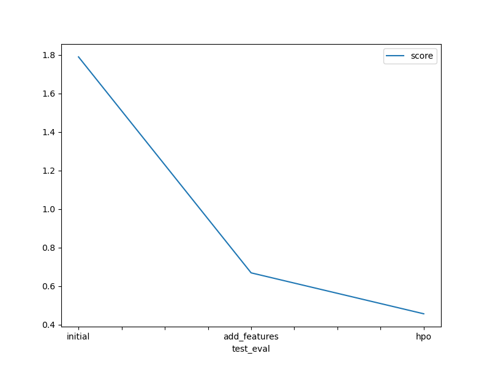
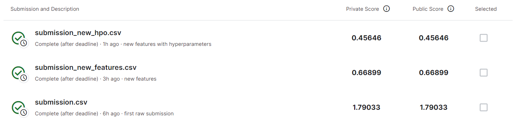

# Report: Predict Bike Sharing Demand with AutoGluon Solution
#### Josi Kie Nababan

## Initial Training
### What did you realize when you tried to submit your predictions? What changes were needed to the output of the predictor to submit your results?
It should be in the form of DataFrame. I have to put predict function from predictions with test datasets. Then, passed the result to .csv file. 

### What was the top ranked model that performed?
Mine was the hpo model. It is because the hyperparameters got optimized. 

## Exploratory data analysis and feature creation
### What did the exploratory analysis find and how did you add additional features?
Datetime is one of the most important features. I separate it into hours, day, month, and year.

### How much better did your model preform after adding additional features and why do you think that is?
I see improvement on the kaggle score, from 1.79033 to 0.66899. In this case problem, the additional features help model to capture patterns in different time better.

## Hyper parameter tuning
### How much better did your model preform after trying different hyper parameters?
It got improved, from kaddle score 0.66899 to 0.45646.

### If you were given more time with this dataset, where do you think you would spend more time?
I want to explore temperatures, and try hyper parameters one by one.

### Create a table with the models you ran, the hyperparameters modified, and the kaggle score.
|model|hpo1|hpo2|hpo3|score|
|--|--|--|--|--|
|initial|default|default|default|1.79033|
|add_features|default|default|default|0.66899|
|hpo|GBM: {num_boost_round: 100}|CAT: {iterations: 1000}|RF: {n_estimators: 200}|0.45646|

### Create a line plot showing the top kaggle score for the three (or more) prediction submissions during the project.

TODO: Replace the image below with your own.

## Summary
Predict Bike Sharing Demand with AutoGluon Solution
Autogluon make the processing, creating, and tuning of ML models automated. I can optimizes hyperparameters to make better predictions in Bike Sharing Demand project. It provides better ways to train data easier.

### Kaddle Score

