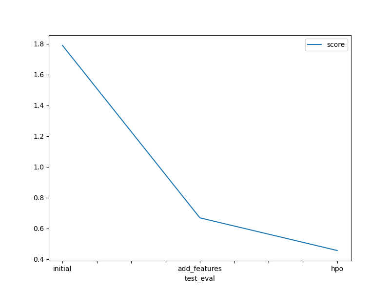

# Report: Predict Bike Sharing Demand with AutoGluon Solution
#### Josi Kie Naban

## Initial Training
### What did you realize when you tried to submit your predictions? What changes were needed to the output of the predictor to submit your results?
It should be in the form of DataFrame. I have to put predict function from predictions with test datasets. Then, passed the result to .csv file. Also, make sure the kaggle score is better.

### What was the top ranked model that performed?
Based on leaderboard() from all predictions, the top ranked model is WeightedEnsemble_L3.

## Exploratory data analysis and feature creation
### What did the exploratory analysis find and how did you add additional features?
Datetime is one of the most important features. I separate it into hours, day, month, and year.

### How much better did your model preform after adding additional features and why do you think that is?
Our data have more information and context for the model to learn from. It helps model to more understand about the data. Also, Kaggle scores become better, from 1.79919 to 0.61328. 

## Hyper parameter tuning
### How much better did your model preform after trying different hyper parameters?
It got improved, from kaggle score 0.61328 to 0.46929. However, the RMSA from leaderboard() is -36.148066. Hyper parameter influences the behavior and performance of the model. 

### If you were given more time with this dataset, where do you think you would spend more time?
I want to explore temperatures, and try different parameter tunning.

### Create a table with the models you ran, the hyperparameters modified, and the kaggle score.
|model|hpo1|hpo2|hpo3|score|
|--|--|--|--|--|
|initial|default|default|default|1.79919|
|add_features|default|default|default|0.61328|
|hpo|GBM: {num_boost_round: 100}|CAT: {iterations: 1000}|RF: {n_estimators: 200}|0.46929|

### Create a line plot showing the top kaggle score for the three (or more) prediction submissions during the project.

TODO: Replace the image below with your own.

## Summary
Predict Bike Sharing Demand with AutoGluon Solution
Autogluon make the processing, creating, and tuning of ML models automated. I can optimizes hyperparameters to make better predictions in Bike Sharing Demand project. It provides better ways to train data easier.
